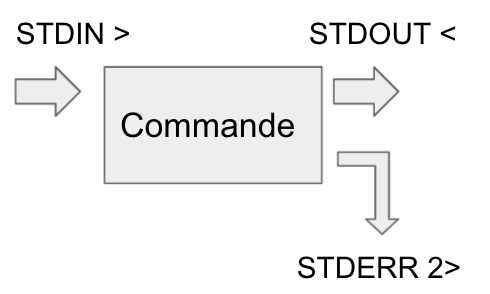

As we have seen so far Unix commands can read files. Of course they can also write to files.
A Unix command can be thought of as a program that reads from a standard input (STDIN) and writes to two different channels, a standard output (STDOUT) and a standard error output (STDERR). 

- The standard input allows to read a file or a text stream
- the standard output allows to print the results of the command
- the error output allows to print messages during the execution or when the program encounters an error.
 
